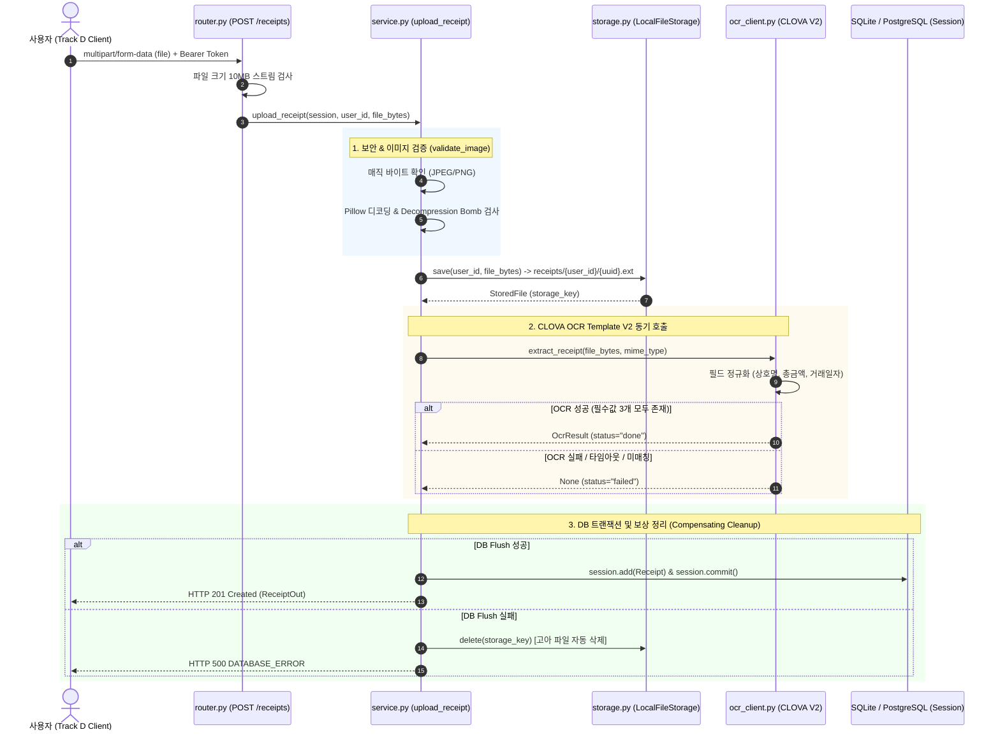

# VAT-AI — 소상공인 부가가치세 자동 신고 서비스

VAT-AI는 소상공인을 위한 부가가치세 자동 신고 보조 시스템입니다.
영수증 이미지를 업로드하면 Naver CLOVA OCR로 매입 내역을 자동 판독하고, AI 세법 분석을 거쳐 매입 보관함 및 세무 신고 데이터로 집계합니다.

현재 브랜치(`track-b-align-a`)는 **Track A(계정/인증)**, **Track B(영수증/OCR 백엔드)**, **Track C(공제 판별·리포트 백엔드)**, **Track D(React 프론트엔드)**를 통합한 코드베이스입니다. Track C의 프론트엔드 화면은 아직 실제 API 대신 목데이터를 사용합니다.

---

## 목차
1. [트랙별 역할 및 통합 현황](#1-트랙별-역할-및-통합-현황)
2. [디렉터리 구조](#2-디렉터리-구조)
3. [환경 설정 (.env)](#3-환경-설정-env)
4. [설치 및 실행 가이드](#4-설치-및-실행-가이드)
5. [주요 API 명세](#5-주요-api-명세)
6. [Track B 아키텍처 및 함수별 상세 로직](#6-track-b-아키텍처-및-함수별-상세-로직)
7. [팀 협업을 위한 엔지니어링 개발 규약](#7-팀-협업을-위한-엔지니어링-개발-규약)
8. [백엔드 테스트 스위트 심층 분석](#8-백엔드-테스트-스위트-심층-분석)
9. [현재 연동 상태 및 개발 참고사항](#9-현재-연동-상태-및-개발-참고사항)

---

## 1. 트랙별 역할 및 통합 현황

| 트랙 | 주요 역할 | 현재 구현 및 연동 상태 |
| :--- | :--- | :--- |
| **Track A** | 계정 및 사용자 인증 | **완료** — 회원가입, 로그인, `/auth/me`, JWT Bearer 토큰 인가, 비밀번호 bcrypt 해싱 |
| **Track B** | 영수증 파이프라인 & DB | **완료** — 이미지 검증·로컬 저장, CLOVA OCR V2 어댑터, 영수증 CRUD, Alembic 통합 마이그레이션 (`users`, `receipts`, `deductions`) |
| **Track D** | 사용자 UI 및 클라이언트 | **완료** — React 19 기반 모바일 퍼스트 UI, 백엔드 인증 연동, 영수증 촬영/업로드, OCR 결과 처리, 매입 보관함 실시간 연동 |
| **Track C** | 세액 공제 판별 & 리포트 | **백엔드 완료** — OpenAI 기반 공제 판별, deduction upsert, `POST /receipts/{id}/analyze`, `GET /reports` 구현 완료. 프론트엔드는 현재 목데이터 사용 |

---

## 2. 디렉터리 구조

```text
VAT-AI/
├── .claude/                # Claude 개발/실행 환경 설정 (launch.json)
├── app/                    # FastAPI 백엔드 애플리케이션
│   ├── auth/               # [Track A] 인증 모듈 (Router, Service, Schemas, Models)
│   ├── common/             # 공통 예외(AppException), 에러 핸들러, 응답 규격
│   ├── core/               # 앱 설정(config.py), DB 세션(database.py), 보안(security.py)
│   ├── deduction/          # [Track C] 공제 판별 및 리포트 백엔드 모듈
│   ├── migrations/         # Alembic 마이그레이션 환경 및 버전 스크립트
│   │   └── versions/       # 0632cbc850ef (users, receipts, deductions 생성)
│   ├── receipts/           # [Track B] 영수증 파이프라인 (Storage, OCR Client, Service, Router)
│   └── main.py             # FastAPI 엔트리포인트 및 라우터 등록
├── frontend/               # [Track D] React 19 + Vite 8 프론트엔드
│   ├── src/
│   │   ├── api/            # Axios API 클라이언트 (auth.ts, receipts.ts, client.ts)
│   │   ├── components/     # UI 공통 컴포넌트 (StorageView, SummaryCard 등)
│   │   ├── pages/          # 페이지 단위 컴포넌트 (LoginPage, CapturePage, Storage 등)
│   │   ├── mocks/          # 현재 Track C 화면 등을 위한 목데이터
│   │   └── styles/         # 디자인 토큰(tokens.css) 및 스타일(ui.css)
│   ├── package.json
│   └── vite.config.ts
├── storage/                # 업로드된 원본 영수증 파일 로컬 저장소
├── tests/                  # 백엔드 pytest/unittest 테스트 스위트 (Track C 테스트 포함)
├── .env.example            # 백엔드 환경변수 예시 템플릿
├── requirements.txt        # 운영 의존성
├── requirements-dev.txt    # 개발 및 테스트 의존성
└── alembic.ini             # Alembic 설정
```

---

## 3. 환경 설정 (.env)

저장소 루트에 `.env` 파일을 생성하고 필요한 값을 설정합니다. (`.env`는 절대 커밋하지 마세요.)

```bash
cp .env.example .env
```

`.env.example`은 로컬 PostgreSQL 연결 예시를 제공합니다. SQLite로 시작하려면 `DB_URL=sqlite:///./vat_ai.db`로 바꾸고, 실제 공제 판별을 사용하려면 `OPENAI_API_KEY`를 설정합니다.

### 백엔드 환경변수 (`.env`)

| 변수명 | 기본값 | 설명 |
| :--- | :--- | :--- |
| `DB_URL` | `sqlite:///./vat_ai.db` | 데이터베이스 연결 URL (PostgreSQL 또는 SQLite) |
| `JWT_SECRET` | `local-dev-secret-change-me` | JWT 토큰 서명용 비밀키 |
| `JWT_ALGORITHM` | `HS256` | 토큰 암호화 알고리즘 |
| `JWT_EXPIRE_MINUTES`| `1440` | 토큰 만료 시간 (기본 24시간) |
| `OPENAI_API_KEY` | - | `POST /receipts/{id}/analyze`의 OpenAI 공제 판별 API 키 |
| `STORAGE_DIR` | `storage` | 업로드 영수증 파일 로컬 저장 디렉터리 경로 |
| `MAX_UPLOAD_SIZE_BYTES` | `10485760` (10MB) | 업로드 허용 최대 파일 크기 |
| `MAX_IMAGE_PIXELS` | `25000000` | 이미지 최대 픽셀 수 제한 (Decompression Bomb 방어) |
| `CLOVA_OCR_API_URL` | - | Naver Cloud CLOVA OCR Template V2 invoke URL |
| `CLOVA_OCR_SECRET_KEY` | - | Naver Cloud CLOVA OCR Secret Key |
| `CLOVA_TIMEOUT_SECONDS`| `10.0` | OCR API 호출 타임아웃(초) |

### 프론트엔드 환경변수 (`frontend/.env`)

```env
VITE_API_URL=http://localhost:8000
```
*(포트 8001 등 별도 포트에서 백엔드를 띄울 경우 해당 포트 주소로 설정합니다.)*

---

## 4. 설치 및 실행 가이드

### 4.1 백엔드 구동 (Python 3.11+)

#### Windows (PowerShell):
```powershell
# 1. 가상환경 생성 및 활성화
python -m venv .venv
.\.venv\Scripts\Activate.ps1

# 2. 의존성 설치
python -m pip install -r requirements-dev.txt

# 3. 데이터베이스 마이그레이션 (users, receipts, deductions 테이블 생성)
python -m alembic upgrade head

# 4. 백엔드 개발 서버 구동
python -m uvicorn app.main:app --reload --port 8000
```

#### macOS / Linux:
```bash
python3 -m venv .venv
source .venv/bin/activate
pip install -r requirements-dev.txt
python3 -m alembic upgrade head
python3 -m uvicorn app.main:app --reload --port 8000
```

- **Swagger API 대화형 문서**: `http://localhost:8000/docs`
- **ReDoc 명세서**: `http://localhost:8000/redoc`

### 4.2 백엔드 테스트

```powershell
python -m pytest
python -m unittest tests\test_deduction.py
```

---

### 4.3 프론트엔드 구동 (Node.js 18+)

```bash
cd frontend
npm install
npm run dev
```

- **프론트엔드 웹 애플리케이션**: `http://localhost:5173`

---

## 5. 주요 API 명세

모든 보호된 API는 `Authorization: Bearer <access_token>` 헤더가 필요합니다.

### 5.1 계정 및 인증 (Track A)
| Method | Endpoint | 설명 | 인증 |
| :--- | :--- | :--- | :---: |
| `POST` | `/auth/register` | 신규 회원가입 및 즉시 JWT 토큰 발급 (HTTP 201) | 불필요 |
| `POST` | `/auth/login` | 로그인 및 JWT 토큰 발급 (HTTP 200) | 불필요 |
| `GET` | `/auth/me` | 현재 로그인된 사용자 정보 조회 | 필요 |

### 5.2 영수증 및 OCR 파이프라인 (Track B)
| Method | Endpoint | 설명 | 인증 |
| :--- | :--- | :--- | :---: |
| `POST` | `/receipts` | 영수증 이미지 업로드, 저장, 동기 CLOVA OCR 호출 (HTTP 201) | 필요 |
| `GET` | `/receipts` | 로그인한 사용자의 영수증 목록 최신순 조회 (HTTP 200) | 필요 |
| `GET` | `/receipts/{id}` | 특정 영수증의 상세 정보 및 OCR 판독 결과 조회 | 필요 |

> **OCR 처리 정책 안내 (api-spec.md §0/§3.2)**:
> - 영수증 업로드는 OCR 성공/실패 여부와 관계없이 파일 저장 및 DB 등록을 정상 완료합니다 (항상 **HTTP 201 Created** 반환).
> - 세무 필수 3개 필드(상호명, 금액, 거래일자)가 온전히 판독되면 `status="done"`으로 기록됩니다.
> - 템플릿 불일치, 해상도 미달 등으로 인식이 안 된 경우 `status="failed"`로 저장되며 추출 필드는 `null`로 보존됩니다.

### 5.3 공제 판별 및 리포트 (Track C)
| Method | Endpoint | 설명 | 인증 |
| :--- | :--- | :--- | :---: |
| `POST` | `/receipts/{id}/analyze` | OpenAI 판별 결과를 생성 또는 갱신 | 필요 |
| `GET` | `/reports?period=YYYY-MM` | 해당 월의 공제 가능 금액과 항목 집계 | 필요 |

Track C backend는 구현되어 있습니다. 현재 React 분석·리포트 화면은 별도의 frontend 연동 작업 전까지 목데이터를 사용합니다.

---

## 6. Track B 아키텍처 및 함수별 상세 로직

### 6.1 영수증 처리 시퀀스 다이어그램



---

### 6.2 모듈별 함수 상세 로직

#### A. 파일 검증 및 오케스트레이션 (`app/receipts/service.py`)

- **`detect_image_type(file_bytes: bytes) -> tuple[str, str] | None`**
  - **기능**: 클라이언트의 `Content-Type` 헤더에 의존하지 않고, 파일 바이너리의 첫 바이트(Magic Bytes)를 검사하여 실제 이미지 형식을 판별합니다.
  - **로직**: `\xff\xd8\xff`로 시작하면 `("image/jpeg", "jpg")`, `\x89PNG\r\n\x1a\n`로 시작하면 `("image/png", "png")`를 반환하고, 일치하지 않는 포맷(WebP, GIF 등)은 `None`을 반환합니다.
- **`_decode_image(file_bytes: bytes, media_type: str) -> None`**
  - **기능**: 손상된 이미지 및 Decompression Bomb(압축 해제 시 메모리를 고갈시키는 폭탄 이미지) 공격을 방어합니다.
  - **로직**: `Pillow`로 이미지를 열어 `DecompressionBombWarning` 발생 시 즉시 예외로 승격하며, `width * height > MAX_IMAGE_PIXELS(25,000,000)` 검증 후 `image.verify()`와 `image.load()`로 실제 픽셀 디코딩 무결성을 점검합니다.
- **`validate_image(file_bytes: bytes, content_type: Optional[str]) -> tuple[str, str]`**
  - **기능**: 파일 크기, 매직 바이트, 클라이언트 MIME 타입 일치 여부를 종합 검증하는 공개 인터페이스입니다.
  - **로직**: 0바이트 또는 10MB 초과 파일 차단, 매직 바이트 판별 결과와 선언된 Content-Type이 다를 경우(스푸핑) `400 VALIDATION_ERROR`를 발생시킵니다.
- **`upload_receipt(session, user_id, file_bytes, content_type) -> ReceiptOut`**
  - **기능**: 영수증 파이프라인의 전체 실행을 조율하는 핵심 트랜잭션 함수입니다.
  - **로직**:
    1) `validate_image` 검증
    2) `storage.save`로 디스크 영속화
    3) `ocr_client.extract_receipt` 동기 호출
    4) 상호명·금액·일자 3요소 완비 시 `status="done"`, 결측 시 `status="failed"` 및 필드 `null` 설정
    5) `session.flush()` 시도 — 실패 시 `_delete_after_failure`로 방금 저장된 파일을 삭제하여 고아 파일 생성 방지
    6) `session.commit()` 후 `ReceiptOut` 반환
- **`list_receipts(session, user_id) -> list[ReceiptSummary]`**
  - **기능**: 사용자 소유의 영수증 목록을 `created_at DESC` 최신순으로 반환합니다. 목록 조회 성능을 위해 무거운 `ocr_raw`와 `image_url`은 제외하고 반환합니다.
- **`get_receipt(session, user_id, receipt_id) -> ReceiptOut`**
  - **기능**: 특정 영수증의 상세 정보와 OCR 원문 전체를 조회합니다. `Receipt.id`와 `Receipt.user_id`를 동시에 조회하여 타인 소유 데이터 조회를 원천 방어(`404 NOT_FOUND`)합니다.

---

#### B. 스토리지 추상화 계층 (`app/receipts/storage.py`)

- **`FileStorage(Protocol)` & `LocalFileStorage`**
  - **기능**: 로컬 파일 저장을 향후 S3/NCP Object Storage로 교체할 때 상위 서비스 로직 수정을 없애기 위한 인터페이스 추상화입니다.
- **`save(user_id, content, media_type, extension) -> StoredFile`**
  - **경로 규칙**: `storage/receipts/{user_id}/{uuid4}.{ext}`
  - 사용자별 독립 디렉터리로 파일을 격리하며, DB에는 루트 기준 상대 키(`receipts/...`)만 보관합니다.
- **`delete(key: str) -> None`**
  - Path Traversal(상위 디렉터리 탈출) 공격 방지를 위해 대상 경로의 `resolve()` 결과가 반드시 `root`의 자식인지 검증한 뒤 삭제합니다.

---

#### C. Naver CLOVA Template OCR V2 어댑터 (`app/receipts/ocr_client.py`)

- **`extract_receipt(image_bytes: bytes, mime_type: str) -> Optional[OcrResult]`**
  - **기능**: CLOVA OCR Template V2 `/infer` 엔드포인트와 HTTP POST 통신을 수행합니다.
  - **로직**: `X-OCR-SECRET` 인증 헤더, JSON 메타데이터(`message`), 바이너리 이미지를 멀티파트로 전송하며 타임아웃이나 4xx/5xx 오류 시 시스템 다운 없이 `None`을 반환합니다.
- **`parse_response(payload: object) -> Optional[OcrResult]`**
  - **기능**: CLOVA JSON 응답 트리에서 세무 필수 필드를 정규화 추출합니다.
  - **매핑 후보군**:
    - **상호명**: `("상호명", "상호", "가맹점명", "상점명", "store_name")`
    - **총금액**: `("총금액", "총액", "결제금액", "합계", "total_amount", "total")`
    - **거래일자**: `("거래일자", "거래일", "작성일자", "transaction_date", "date")`
  - 세 필드 중 하나라도 누락되면 `None`을 반환하여 불완전한 데이터가 세무 계산에 반영되지 않도록 차단합니다.
- **`_parse_amount(value: str | None) -> float | None`**
  - 콤마(`,`)와 공백을 제거하고 정규식(`-?\d[\d,]*(?:\.\d+)?`) 및 `Decimal`로 변환하여 부동소수점 오차를 방지하고 음수 금액을 걸러냅니다.
- **`_parse_date(value: str | None) -> date | None`**
  - `(20\d{2})\D+(\d{1,2})\D+(\d{1,2})` 패턴을 통해 영수증의 다양한 표기(`2026.09.22`, `2026-09-22`, `2026년 9월 22일`)를 파이썬 표준 `datetime.date` 객체로 정규화합니다.

---

## 7. 팀 협업을 위한 엔지니어링 개발 규약

### 규약 1. 동기식 OCR 호출 및 HTTP 201 실패 응답 정책 (api-spec.md §0 확정안)
- 영수증 업로드는 비동기 큐가 아닌 동기식 API로 동작합니다.
- OCR 판독이 실패(템플릿 불일치, 해상도 미달, 외부 타임아웃 등)하더라도 **HTTP 응답은 항상 `201 Created`**로 반환합니다.
- 실패 표시는 응답 바디의 **`status: "failed"`**와 추출 필드 전체 `null`로 전달합니다.
- **설계 의도**: 업로드된 원본 영수증은 세무 증빙 및 추후 수동 수정을 위해 안전하게 보존되어야 하므로, 외부 OCR 엔진의 일시적 장애가 파일 저장 실패(500)로 이어지지 않도록 격리합니다.

### 규약 2. 파일 보존 및 DB 롤백 보상 규약 (Clean-up on Failure)
- DB 커밋 전(`session.flush()`) 실패 시:
  - 디스크에 생성되었던 고아(Orphan) 파일을 즉시 삭제(`_delete_after_failure`)하여 디스크 공간 누수를 방지합니다.
- DB 커밋 완료(`session.commit()`) 이후 실패 시:
  - 이미 DB 레코드가 확정되었으므로 **파일을 삭제하지 않고 유지**합니다.

### 규약 3. 멀티테넌시(사용자 데이터) 격리 규약
- 모든 영수증 조회/상세/수정 API는 URL 파라미터(`receipt_id`)뿐만 아니라, 토큰에서 추출한 `user_id`를 WHERE 절에 필수로 포함합니다.
- 타인의 영수증 ID로 조회를 시도할 경우, 보안을 위해 존재 여부를 숨기고 일관되게 `404 NOT_FOUND`를 반환합니다.

### 규약 4. 세무 금액 필드 매핑 규칙
- `amount` 필드는 오직 **"총 결제금액(합계)"**만을 매핑합니다.
- 영수증에 '공급가액'만 단독으로 인식된 경우, 부가세가 제외된 금액을 총액으로 오인하여 신고하는 세무 사고를 막기 위해 `status="failed"`로 처리합니다.

---

## 8. 백엔드 테스트 스위트 심층 분석

백엔드 테스트는 pytest 함수형 테스트와 Track C의 unittest 테스트를 함께 포함합니다. 전체 수집 결과는 개발 환경에서 `python -m pytest`로 확인합니다.
모든 테스트는 격리된 메모리/임시 SQLite DB와 임시 파일 디렉터리를 사용하므로 실제 외부 시스템(PostgreSQL, CLOVA API)에 영향을 주지 않습니다.

### 8.1 영수증 및 OCR 파이프라인 테스트 (`tests/test_receipts.py` — 23개)

| 테스트 함수명 | 검증 핵심 내용 |
| :--- | :--- |
| `test_upload_success_persists_receipt_and_private_file` | 해피패스: PNG 업로드 시 status="done", 필드 정상 파싱, 디스크 파일 생성, 목록 및 상세 조회의 일관성 검증 |
| `test_upload_success_accepts_valid_jpeg` | JPEG 이미지 포맷에 대한 검증 및 `.jpg` 확장자 저장 일관성 검증 |
| `test_ocr_failure_creates_failed_receipt_with_null_extracted_fields` | OCR 추출 실패 시 HTTP 201 응답과 함께 DB에 status="failed", 필드 null 기록 검증 |
| `test_invalid_file_is_400` | 0바이트 빈 파일, 텍스트 파일 등 손상된 바이너리 업로드 시 400 차단 검증 |
| `test_invalid_image_does_not_call_ocr_or_create_file_or_receipt` | 유효하지 않은 파일 업로드 시 OCR API가 호출되지 않고 파일/DB 레코드가 생성되지 않는 단락 평가(Short-circuit) 검증 |
| `test_webp_is_rejected_before_ocr_and_persistence` | 허용되지 않은 WebP 포맷 차단 검증 |
| `test_size_limit_and_missing_file_are_400` | 10MB 크기 제한 초과 및 멀티파트 필드 누락 시 400 검증 |
| `test_content_type_mismatch_is_400` | 확장자는 jpg인데 실제 내용은 png인 MIME 스푸핑 차단 검증 |
| `test_receipts_require_authentication` | 토큰 없이 접근 시 401 UNAUTHORIZED 검증 |
| `test_receipts_are_isolated_by_owner` | A 사용자가 업로드한 영수증을 B 사용자가 조회할 수 없도록 테넌트 격리 검증 |
| `test_missing_receipt_detail_is_404` | 존재하지 않는 영수증 ID 조회 시 404 검증 |
| `test_receipt_list_is_newest_first` | 영수증 목록 조회 시 `created_at DESC` 최신순 정렬 검증 |
| `test_parser_normalizes_vendor_amount_and_transaction_date` | CLOVA 응답에서 쉼표 금액("12,000원"), 다양한 날짜 포맷의 정규화 파싱 검증 |
| `test_supply_value_alone_is_not_treated_as_total` | 합계금액 없이 공급가액만 있는 경우 총액으로 오인하지 않고 실패 처리하는 검증 |
| `test_ocr_timeout_and_malformed_response_become_failed_result` | 외부 OCR 타임아웃 및 깨진 JSON 응답 수신 시 시스템 다운 없이 failed 처리 검증 |
| `test_ocr_http_failures_become_failed_result` | 외부 OCR이 400/500 에러를 줄 때 안전하게 failed 처리 검증 |
| `test_ocr_request_uses_custom_v2_multipart_contract` | CLOVA Template V2 규격(X-OCR-SECRET, message body) 준수 여부 검증 |
| `test_non_template_ocr_shapes_do_not_succeed` | General OCR이나 Document OCR 등 다른 규격 응답을 잘못 파싱하지 않도록 방어 검증 |
| `test_storage_failure_is_distinct_from_ocr_failure` | 로컬 디스크 I/O 실패 시 OCR 실패로 위장하지 않고 500 STORAGE_ERROR 반환 검증 |
| `test_database_failure_cleans_file_and_is_distinct` | DB Flush 실패 시 저장했던 디스크 파일을 자동 삭제(롤백)하는 원자성 검증 |
| `test_refresh_failure_after_commit_keeps_row_and_file` | DB Commit 이후 응답 생성 실패 시 이미 확정된 데이터와 파일을 삭제하지 않는 내구성 검증 |
| `test_uncertain_commit_failure_keeps_row_and_file` | 커밋 경계 오류 시 참조 파일 보존 정책 검증 |
| `test_unexpected_ocr_error_is_not_hidden_as_failed` | 예기치 못한 내부 런타임 버그는 500으로 표출하여 모니터링되도록 하는 검증 |

### 8.2 DB 마이그레이션 테스트 (`tests/test_migrations.py` — 1개)
- `test_alembic_upgrade_head_creates_a_base_schema`:
  - 임시 격리 SQLite DB에서 `alembic upgrade head`를 단독 실행.
  - 리비전 `0632cbc850ef` 적용 후 `users`, `receipts`, `deductions`, `alembic_version` 4개 테이블이 누락 없이 자동 생성되는지 DDL 무결성 검증.

### 8.3 인증 및 계정 테스트 (`tests/test_auth.py` — 11개)
- Track A와 연동된 회원가입, 중복 이메일 차단(409), 정상 로그인(200), 비밀번호 불일치(401), `/auth/me` 조회, 만료된 JWT 토큰 거부 등 계정 보안 전반 검증.

### 8.4 공제 판별 및 리포트 테스트 (`tests/test_deduction.py` — 5개)
- 공제 판별 생성·upsert, 타 사용자 영수증 404, 외부 AI 오류 502, 월별 리포트 집계, 잘못된 `period`의 400 응답을 검증합니다.

---

## 9. 현재 연동 상태 및 개발 참고사항

1. **프론트엔드 - 백엔드 연동 상태**:
   - 로그인 / 회원가입 → 대시보드 사용자 정보 실시간 노출
   - 촬영 페이지(`CapturePage`)를 통한 영수증 업로드
   - OCR 처리 결과 화면(`OcrProcessingPage`) 및 실패 시 매입 보관함(`PurchaseStoragePage`) 안내 흐름이 실제 API와 연동되어 있습니다.
2. **Naver CLOVA OCR 연동 상태**:
   - 백엔드의 CLOVA Template V2 통신 파이프라인은 정상 작동(HTTP 200)합니다.
   - 단, 실제 영수증 인식은 **네이버 클라우드 OCR 콘솔(도메인: 58199, 템플릿: 43533)에 등록된 기준 샘플 양식 및 판독 영역과 일치하는 영수증**이어야 매칭(`inferResult: SUCCESS`)됩니다. 양식이 다를 경우 템플릿 매칭 실패(`NOT_FOUND: not found matched template`)로 인해 `status="failed"` 처리됩니다.
   - 추후 콘솔의 [테스트] 화면에서 판독 영역(상호명, 금액, 일자)을 기준 양식과 재매칭한 후 [배포]를 갱신해야 실제 인식이 완료(`done`)됩니다.
3. **공제 판별(Track C) 상태**:
   - backend의 OpenAI 공제 판별, deduction upsert, 월별 리포트 endpoint는 구현되어 있습니다.
   - 프론트엔드의 세액 분석 결과 및 리포트 화면은 현재 목데이터(`mocks/`)를 사용하며, 실제 Track C API 연동은 별도 작업입니다.

## 10. 최근 변경 사항 — CapturePage 실시간 카메라 촬영 기능 추가 (2026-09-23)

기존 `CapturePage.tsx`는 `<input type="file">`로 OS 파일 선택창(사진첩/카메라 앱)을 여는 방식만 구현되어 있어, 앱 내에서 실시간 카메라 미리보기가 동작하지 않는 상태였다. 아래와 같이 수정했다.

- `navigator.mediaDevices.getUserMedia()`로 카메라 스트림을 받아 `<video>` 태그에 실시간 미리보기 연결
- 중앙 "촬영" 버튼 클릭 시 현재 비디오 프레임을 `<canvas>`에 그려 JPEG `Blob`으로 변환 → 기존 `uploadReceipt()` 함수로 그대로 업로드 (백엔드 연동 로직 변경 없음)
- "카메라 전환" 버튼에 `facingMode`(전/후면) 토글 기능 연결 — 이전에는 빈 함수(`onClick={() => {}}`)였음
- 카메라 전환/언마운트 시 이전 스트림을 `track.stop()`으로 반드시 정리하도록 처리 (미정리 시 카메라 잔류 점등 문제 방지)
- "앨범에서 선택" 경로(`<input type="file">`)는 그대로 유지 — 미리 찍어둔 사진 업로드용
- 미리보기 영역에 `aspectRatio: "3 / 4"`와 `maxHeight: 640`을 지정 — 데스크톱처럼 세로로 긴 브라우저 창에서 영상이 과도하게 확대/크롭되던 문제 완화

**확인된 사항**: 노트북 웹캠으로 실시간 촬영 → `POST /receipts` 요청 `201 Created`, CORS 정상 확인 완료.

**참고**: 데스크톱 브라우저처럼 뷰포트가 매우 세로로 긴 환경에서는 미리보기 영역 아래로 약간의 여백이 남을 수 있음(실제 모바일 기기에서는 화면 비율상 거의 나타나지 않을 것으로 예상). 필요 시 추후 레이아웃 미세조정 검토.
