# VAT-AI — 소상공인을 위한 AI 부가가치세 신고 지원 서비스

## Document AI 작업 공유 — 2026-10-05

현재 `feature/document-ai`는 최신 `main`의 사업자 검증·개발환경을 보존하면서 영수증 구조화·사진 대조·OCR 확정·거래 증빙 연결을 추가한 작업 브랜치입니다. 아래의 기존 Sprint 문서는 이 절과 [현재 API 명세](api-spec.md)를 함께 참고하세요.

- **구현:** 고정 ID 품목, 수량·인쇄/실효 단가·행 금액, 할인 범위, 과세/면세/VAT/거래·결제·할인 전 금액, 값 상태·좌표·출처, 인증 사진 조회와 품목 편집.
- **확정 방어:** PATCH/확정 POST 모두 `base_revision` 필수. 충돌은 `409 DATA_CONFLICT`; 화면은 최신 데이터 재조회. 확정과 거래 생성은 동일 DB 트랜잭션으로 처리합니다.
- **거래:** 복수 증빙 연결, 대표 증빙 한 번 집계, 중복 후보의 사용자 MERGE/SEPARATE, 음수 반품·취소와 원거래 연결·초과 조정 방어.
- **범위:** OCR 사실 확인과 세무분석 확정은 별도입니다. 전용 세금계산서/계산서 자동 추출·공제 판단·PDF·외부 RAG/Rule Engine 통합은 이 변경에서 지원 완료로 표시하지 않습니다.
- **migration:** `20261005a6` 단일 head. 사업자 프로필의 `015d7b1f7bdb`와 Document AI의 `20261005a5`를 merge revision으로 연결합니다. 기존 migration 이력과 금액·품목·확정 기록을 유지합니다.
- **의존성:** requirements.txt, requirements-dev.txt, requirements.md에 이 PR 자체의 변경은 없습니다. PyTorch 실험은 앱 실행 경로에 들어가지 않으며 별도 실험 환경이 필요합니다.

### 팀원이 실행하는 순서

아래 명령은 프로젝트 루트의 PowerShell 기준입니다. 기존 사용자 DB에는 먼저 백업한 뒤 migration을 적용하세요. `.env`는 `.env.example`을 참고해 각자 설정하며 저장소에 올리지 않습니다. 공용 PostgreSQL 16 + pgvector의 `docker-compose.yml`과 `/health`는 기존 main 구성을 사용합니다.

```powershell
python -m venv .venv
.\.venv\Scripts\python.exe -m pip install -r requirements-dev.txt
.\.venv\Scripts\python.exe -m alembic heads
.\.venv\Scripts\python.exe -m alembic upgrade head
.\.venv\Scripts\python.exe -m alembic current
.\.venv\Scripts\python.exe -m pytest -q
.\.venv\Scripts\python.exe -m uvicorn app.main:app --reload --port 8000
```

다른 터미널에서 `frontend`로 이동해 `npm ci`, `npm run dev`를 실행합니다. 백엔드 포트가 다르면 로컬 `frontend/.env`의 `VITE_API_URL`을 맞춥니다. 사용자 사진 업로드는 설정된 CLOVA OCR을 호출할 수 있습니다. 단위·회귀 테스트는 외부 OCR/NTS 응답을 격리합니다.

### API 연결 시 확인할 점

- 목록은 요약 응답이며 사진 대조에는 `GET /receipts/{id}`를 사용합니다. 원본은 인증된 `GET /receipts/{id}/image`로 조회합니다.
- 신규 화면은 `line_items`를 사용합니다. `items`/`item_amounts`는 호환용이며 두 입력 형식을 한 PATCH에서 동시에 수정하면 거절됩니다.
- 품목 누락값은 null과 READ/ABSENT/FAILED/UNREVIEWED/NOT_APPLICABLE로 구분합니다. 누락 수량을 1로 만들지 않습니다.
- 확정은 저장 응답의 revision으로 요청합니다. 다른 세션이 바꾸면 재조회 후 확인해야 합니다.
- `/transactions/{id}`의 canonical facts/items를 한 번 사용합니다. 연결된 모든 증빙을 추가 구매로 합산하지 않습니다.
- `tax_analysis_confirmed=false`, `deduction_status=UNDETERMINED`와 로컬 계약 상태를 후속 파트에서 존중해야 합니다.

### 평가 결과와 한계

공유 전 최신 main 통합 상태에서 백엔드 205개 테스트와 프론트 빌드(113 modules)가 통과했습니다. Alembic head는 `20261005a6` 하나이며 신규 DB와 양쪽 팀 migration 출발점의 upgrade·기존 데이터 보존을 검사했습니다. 로컬 DB 검증은 격리된 SQLite 기준입니다. PostgreSQL + pgvector 검증은 PR의 기존 GitHub Actions CI 결과로 별도 확인하며, 이 문서의 로컬 테스트 통과와 동일시하지 않습니다.

실제 한국 영수증 30건의 동일 CLOVA 저장 응답을 비교한 잠정 Baseline입니다. 개선 품목명 F1=0.676, 전체 품목 행 F1=0.511, VAT 정확 일치율=77.3%, 거래총액=57.1%, 결제금액=40.0%입니다. 엄격한 필드·품목 오류 기준의 수정 필요 비율은 100%입니다. 확장 정답은 독립 검증되지 않았습니다.

CNN·MobileNet 비교는 인위적 흐림·저조도·잘림·기울기 조건 실험입니다. 실제 품질 gold는 0/30이며 실제 정상 오거절률은 미측정입니다. 학습 모델은 앱에 적용하지 않았고 전처리+새 OCR 비교도 하지 않았습니다. 실제 사진·캐시·개인 DB·비밀 키·모델 checkpoint는 이 PR에 포함하지 않습니다.

평가 프로그램은 `app/receipts/evaluation.py`, 실험 프로그램은 `app/receipts/quality_experiment.py`에 있습니다. 별도 확보한 로컬 ROOT에 각각 `test_dataset.jsonl`/기존 예측/캐시/사진이 필요하므로 Git clone만으로 기존 30건 결과를 재생성할 수는 없습니다. 공개 데이터 재배포 범위와 정답 검증은 별도 확인합니다.

자세한 데이터 계약·함수·화면·평가 설명은 [Document AI 코드 해설](docs/document-ai-guide.md)을 참고하세요. 개발·PR·병합 기준은 [CONTRIBUTING.md](CONTRIBUTING.md)를 따릅니다. main 직접 push나 PR 자동 병합은 하지 않습니다.

---


VAT-AI는 소상공인의 증빙 수집·구조화, 사업자정보 확인, 매입세액 공제 검토를 구현하고 예상세액 확인과 신고 전 Review를 목표로 합니다. 홈택스 신고서를 자동 제출하지 않습니다.
영수증 이미지를 업로드하면 Naver CLOVA OCR로 매입 내역을 판독하고, AI 분석을 거쳐 매입 보관함 및 세무 신고 검토 데이터로 집계합니다.

현재 `jaehwang/sprint1-business-verification` 브랜치는 **Track A(계정/인증)**, **Track B(영수증/OCR 백엔드)**, **Track C(공제 판별·리포트 및 Sprint 1 사업자 상태조회·회원가입)**, **Track D(React 프론트엔드)**를 통합합니다. 분석·리포트 화면은 아직 목데이터를 사용합니다.


---

## 목차
1. [트랙별 역할 및 통합 현황](#1-트랙별-역할-및-통합-현황)
2. [디렉터리 구조](#2-디렉터리-구조)
3. [환경 설정 (.env)](#3-환경-설정-env)
4. [설치 및 실행 가이드](#4-설치-및-실행-가이드)
5. [주요 API 명세](#5-주요-api-명세)
6. [Track B 아키텍처 및 함수별 상세 로직](#6-track-b-아키텍처-및-함수별-상세-로직)
7. [팀 협업을 위한 엔지니어링 개발 규약](#7-팀-협업을-위한-엔지니어링-개발-규약)
8. [백엔드 테스트 스위트 심층 분석](#8-백엔드-테스트-스위트-심층-분석)
9. [현재 연동 상태 및 개발 참고사항](#9-현재-연동-상태-및-개발-참고사항)
10. [최근 변경 사항 — CapturePage 실시간 카메라 촬영 기능 추가](#10-최근-변경-사항--capturepage-실시간-카메라-촬영-기능-추가-2026-09-23)
11. [Sprint 1 Track C — Business Verification & Signup UX](#11-sprint-1-track-c--business-verification--signup-ux)

---

## 1. 트랙별 역할 및 통합 현황

| 트랙 | 주요 역할 | 현재 구현 및 연동 상태 |
| :--- | :--- | :--- |
| **Track A** | 계정 및 사용자 인증 | **완료** — 회원가입, 로그인, `/auth/me`, JWT Bearer 토큰 인가, 비밀번호 bcrypt 해싱 |
| **Track B** | 영수증 파이프라인 & DB | **완료** — 이미지 검증·로컬 저장, CLOVA OCR V2 어댑터, 영수증 CRUD, Alembic 기반 DB 스키마 |
| **Track D** | 사용자 UI 및 클라이언트 | **완료** — React 19 기반 모바일 퍼스트 UI, 백엔드 인증 연동, 영수증 촬영/업로드, OCR 결과 처리, 매입 보관함 실시간 연동 |
| **Track C** | Sprint 0 공제 판별·리포트; Sprint 1 사업자 상태조회·회원가입 (재황 / Product·Front·Back) | **Sprint 0 구현 결과** — GPT 기반 공제 판별, deduction upsert, 기간별 리포트. **Sprint 1 구현·검증** — 국세청 상태·과세유형 조회 client, User + BusinessProfile 연동, 회원가입 UX 및 실제 NTS API Key 기반 상태조회·회원가입·로그인·`/auth/me` E2E 확인. 분석·리포트 화면은 목데이터 사용. **후속 계획** — Sprint 2 증빙 보관함 v2, Sprint 3 Evidence UI / Context Verification, Sprint 4 Final Review / PDF |

---

## 2. 디렉터리 구조

```text
VAT-AI/
├── .claude/                # Claude 개발/실행 환경 설정 (launch.json)
├── app/                    # FastAPI 백엔드 애플리케이션
│   ├── auth/               # [Track A] 인증 모듈 (Router, Service, Schemas, Models)
│   ├── business/           # [Sprint 1 Track C] 사업자 상태조회·번호 검증·BusinessProfile
│   │   ├── __init__.py
│   │   ├── models.py
│   │   ├── schemas.py
│   │   ├── service.py
│   │   ├── router.py
│   │   └── nts_client.py
│   ├── common/             # 공통 예외(AppException), 에러 핸들러, 응답 규격
│   ├── core/               # 앱 설정(config.py), DB 세션(database.py), 보안(security.py)
│   ├── deduction/          # [Track C] 공제 판별 및 리포트 백엔드 모듈
│   ├── migrations/         # Alembic 마이그레이션 환경 및 버전 스크립트
│   │   └── versions/       # 0632cbc850ef (기본 테이블), 015d7b1f7bdb_add_business_profiles.py
│   ├── receipts/           # [Track B] 영수증 파이프라인 (Storage, OCR Client, Service, Router)
│   └── main.py             # FastAPI 엔트리포인트 및 라우터 등록
├── frontend/               # [Track D] React 19 + Vite 8 프론트엔드
│   ├── src/
│   │   ├── api/            # Axios API 클라이언트 (auth.ts, business.ts, receipts.ts, client.ts)
│   │   ├── components/     # UI 공통 컴포넌트 (StorageView, SummaryCard 등)
│   │   ├── pages/          # 페이지 단위 컴포넌트 (LoginPage, CapturePage, Storage 등)
│   │   ├── mocks/          # 현재 Track C 화면 등을 위한 목데이터
│   │   └── styles/         # 디자인 토큰(tokens.css) 및 스타일(ui.css)
│   ├── package.json
│   └── vite.config.ts
├── storage/                # 업로드된 원본 영수증 파일 로컬 저장소
├── docs/images/sprint1-business/ # Sprint 1 상태조회·회원가입 검증 캡처 8개 및 실호출 성공 캡처 2개
├── tests/                  # 백엔드 pytest/unittest 테스트 스위트 (Track C 테스트 포함)
├── .env.example            # 백엔드 환경변수 예시 템플릿
├── requirements.txt        # 운영 의존성
├── requirements-dev.txt    # 개발 및 테스트 의존성
└── alembic.ini             # Alembic 설정
```

---

## 3. 환경 설정 (.env)

저장소 루트에 `.env` 파일을 생성하고 필요한 값을 설정합니다. (`.env`는 절대 커밋하지 마세요.)

```bash
cp .env.example .env
```

`.env.example`은 로컬 PostgreSQL 연결 예시를 제공합니다. SQLite로 시작하려면 `DB_URL=sqlite:///./vat_ai.db`로 바꿉니다. 실제 공제 판별에는 `OPENAI_API_KEY`, 국세청 사업자 상태조회에는 승인된 `NTS_BUSINESS_API_KEY`가 필요합니다.

### 백엔드 환경변수 (`.env`)

| 변수명 | 기본값 | 설명 |
| :--- | :--- | :--- |
| `DB_URL` | `sqlite:///./vat_ai.db` | 데이터베이스 연결 URL (PostgreSQL 또는 SQLite) |
| `JWT_SECRET` | `local-dev-secret-change-me` | JWT 토큰 서명용 비밀키 |
| `JWT_ALGORITHM` | `HS256` | 토큰 암호화 알고리즘 |
| `JWT_EXPIRE_MINUTES`| `1440` | 토큰 만료 시간 (기본 24시간) |
| `OPENAI_API_KEY` | - | `POST /receipts/{id}/analyze`의 OpenAI 공제 판별 API 키 |
| `NTS_BUSINESS_API_KEY` | 빈 문자열 | 국세청 사업자등록 상태조회 서비스 인증키. 미설정 시 조회 불가 |
| `NTS_BUSINESS_API_URL` | `https://api.odcloud.kr/api/nts-businessman/v1/status` | 국세청 사업자등록 상태조회 URL |
| `NTS_BUSINESS_TIMEOUT_SECONDS` | `10.0` | 상태조회 요청 타임아웃(초). `.env.example`에는 `10`으로 표기 |
| `STORAGE_DIR` | `storage` | 업로드 영수증 파일 로컬 저장 디렉터리 경로 |
| `MAX_UPLOAD_SIZE_BYTES` | `10485760` (10MB) | 업로드 허용 최대 파일 크기 |
| `MAX_IMAGE_PIXELS` | `25000000` | 이미지 최대 픽셀 수 제한 (Decompression Bomb 방어) |
| `CLOVA_OCR_API_URL` | - | Naver Cloud CLOVA OCR Template V2 invoke URL |
| `CLOVA_OCR_SECRET_KEY` | - | Naver Cloud CLOVA OCR Secret Key |
| `CLOVA_TIMEOUT_SECONDS`| `10.0` | OCR API 호출 타임아웃(초) |

### 프론트엔드 환경변수 (`frontend/.env`)

```env
VITE_API_URL=http://localhost:8000
```
*(포트 8001 등 별도 포트에서 백엔드를 띄울 경우 해당 포트 주소로 설정합니다.)*

---

## 4. 설치 및 실행 가이드

### 4.1 백엔드 구동 (Python 3.11+)

#### Windows (PowerShell):
```powershell
# 1. 가상환경 생성 및 활성화
python -m venv .venv
.\.venv\Scripts\Activate.ps1

# 2. 의존성 설치
python -m pip install -r requirements-dev.txt

# 3. 데이터베이스 마이그레이션 (users, receipts, deductions, business_profiles 테이블 생성)
python -m alembic upgrade head

# 4. 백엔드 개발 서버 구동
python -m uvicorn app.main:app --reload --port 8000
```

#### macOS / Linux:
```bash
python3 -m venv .venv
source .venv/bin/activate
pip install -r requirements-dev.txt
python3 -m alembic upgrade head
python3 -m uvicorn app.main:app --reload --port 8000
```

- **Swagger API 대화형 문서**: `http://localhost:8000/docs`
- **ReDoc 명세서**: `http://localhost:8000/redoc`

### 4.2 백엔드 테스트

```powershell
python -m pytest
python -m unittest tests\test_deduction.py
```

---

### 4.3 프론트엔드 구동 (Node.js 18+)

```bash
cd frontend
npm install
npm run dev
```

- **프론트엔드 웹 애플리케이션**: `http://localhost:5173`

---

## 5. 주요 API 명세

모든 보호된 API는 `Authorization: Bearer <access_token>` 헤더가 필요합니다.

### 5.1 계정 및 인증 (Track A)
| Method | Endpoint | 설명 | 인증 |
| :--- | :--- | :--- | :---: |
| `POST` | `/auth/register` | `email`, `password`, 사용자 이름 `name`, 사용자 입력 `business_name`, `business_number`를 받음. 서버 상태조회 후 User + BusinessProfile을 한 트랜잭션에 저장하고 JWT 발급 (HTTP 201) | 불필요 |
| `POST` | `/auth/login` | 기존 `email`/`password` 로그인 및 JWT 발급. 저장된 BusinessProfile을 `user.business`에 포함 (HTTP 200) | 불필요 |
| `GET` | `/auth/me` | 현재 User와 nullable `business` 객체 조회. 비밀번호 해시는 반환하지 않음 | 필요 |

회원가입은 휴업·폐업 상태도 허용합니다. 미등록 번호나 상태조회 실패는 정상 가입으로 우회하지 않습니다.

### 5.2 영수증 및 OCR 파이프라인 (Track B)
| Method | Endpoint | 설명 | 인증 |
| :--- | :--- | :--- | :---: |
| `POST` | `/receipts` | 영수증 이미지 업로드, 저장, 동기 CLOVA OCR 호출 (HTTP 201) | 필요 |
| `GET` | `/receipts` | 로그인한 사용자의 영수증 목록 최신순 조회 (HTTP 200) | 필요 |
| `GET` | `/receipts/{id}` | 특정 영수증의 상세 정보 및 OCR 판독 결과 조회 | 필요 |

> **OCR 처리 정책 안내 (api-spec.md §0/§3.2)**:
> - 영수증 업로드는 OCR 성공/실패 여부와 관계없이 파일 저장 및 DB 등록을 정상 완료합니다 (항상 **HTTP 201 Created** 반환).
> - 세무 필수 3개 필드(상호명, 금액, 거래일자)가 온전히 판독되면 `status="done"`으로 기록됩니다.
> - 템플릿 불일치, 해상도 미달 등으로 인식이 안 된 경우 `status="failed"`로 저장되며 추출 필드는 `null`로 보존됩니다.

### 5.3 공제 판별 및 리포트 (Track C)
| Method | Endpoint | 설명 | 인증 |
| :--- | :--- | :--- | :---: |
| `POST` | `/receipts/{id}/analyze` | OpenAI 판별 결과를 생성 또는 갱신 | 필요 |
| `GET` | `/reports?period=YYYY-MM` | 해당 월의 공제 가능 금액과 항목 집계 | 필요 |

Track C backend는 구현되어 있습니다. 현재 React 분석·리포트 화면은 별도의 frontend 연동 작업 전까지 목데이터를 사용합니다.

### 5.4 사업자등록 상태조회 (Sprint 1 Track C)
| Method | Endpoint | 설명 | 인증 |
| :--- | :--- | :--- | :---: |
| `POST` | `/business/verify` | 회원가입 전 사업자번호의 공백·하이픈을 제거하고 숫자 10자리를 검증한 뒤 국세청 상태조회 API에서 계속·휴업·폐업 상태와 과세유형 조회 | 불필요 |

응답에는 정규화된 `business_number`, `business_status`/`business_status_code`, `tax_type`/`tax_type_code`, `end_date`, `verified`가 포함됩니다. `verified=true`는 **상태조회 성공**을 뜻하며 매입세액 공제 가능성이나 상호명 진위확인을 뜻하지 않습니다. 미등록 사업자와 외부 API 오류는 별도 application error로 처리합니다. 실제 NTS API Key를 사용한 외부 상태조회 호출을 확인했습니다.

### 5.5 Business Profile 데이터 출처 및 검증 정책

`business_name`은 사용자 직접 입력값이고 `business_number`도 사용자가 입력한 뒤 서버가 정규화·형식 검증합니다. `business_status`, `business_status_code`, `tax_type`, `tax_type_code`, `end_date`, `verified_at`은 국세청 상태조회 API 확인값에 근거합니다. 사용자 입력과 API 확인 사실을 구분해 저장합니다.

`verification_status="status_checked"`는 **사업자 상태조회 수행**을 뜻합니다. 상호명·대표자명·개업일자의 진위확인 완료를 뜻하지 않습니다. 휴업·폐업 사업자도 가입할 수 있으며 UI에서 상태를 경고합니다. 상태조회 결과만으로 deduction을 결정하지 않습니다. 국세청 진위확인 API는 Sprint 1 MUST 범위에서 제외한 후속 고도화 대상입니다.

실제 API Key는 로컬 `.env`에서만 관리하고 `.env`는 저장소에 커밋하지 않습니다. README와 검증 이미지에는 실제 API Key 및 JWT를 포함하지 않습니다.

`business_profiles`는 User와 1:1이며 `user_id`는 `users.id` 외래키이자 unique입니다. 테이블에는 `business_number`, `business_name`, 사업자 상태·코드, 과세유형·코드, `end_date`, `verification_status`, `verified_at`, `created_at`을 저장합니다. 기존 기본 테이블 migration은 유지하고 `015d7b1f7bdb_add_business_profiles.py`가 이 테이블을 추가합니다.

---

## 6. Track B 아키텍처 및 함수별 상세 로직

### 6.1 영수증 처리 시퀀스 다이어그램

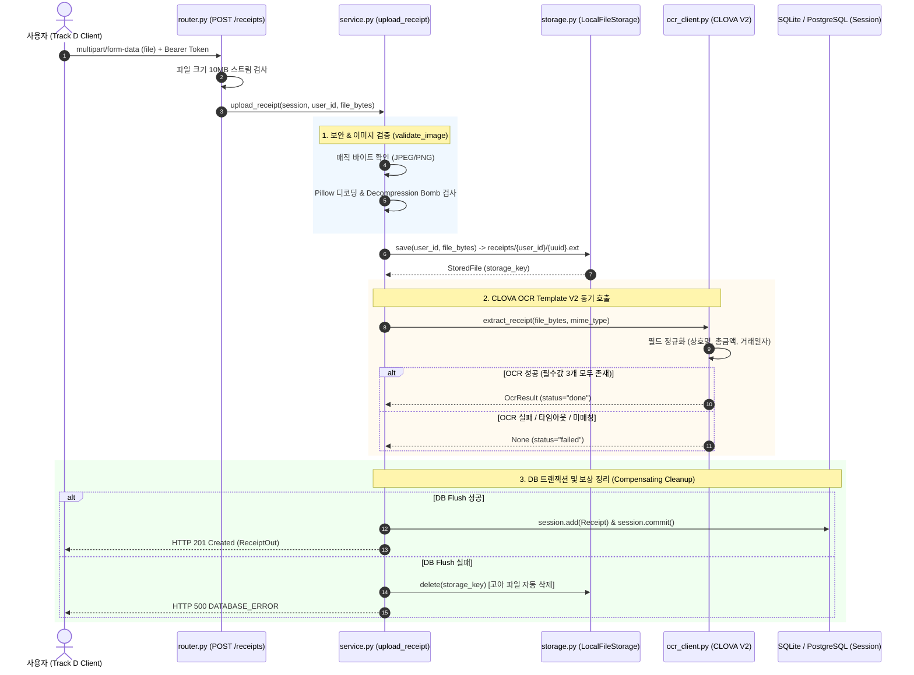
```mermaid
sequenceDiagram
    autonumber
    actor User as 사용자 (Track D Client)
    participant Router as router.py (POST /receipts)
    participant Service as service.py (upload_receipt)
    participant Storage as storage.py (LocalFileStorage)
    participant OCR as ocr_client.py (CLOVA V2)
    participant DB as SQLite / PostgreSQL (Session)

    User->>Router: multipart/form-data (file) + Bearer Token
    Router->>Router: 파일 크기 10MB 스트림 검사
    Router->>Service: upload_receipt(session, user_id, file_bytes)

    rect rgb(240, 248, 255)
        Note over Service: 1. 보안 & 이미지 검증 (validate_image)
        Service->>Service: 매직 바이트 확인 (JPEG/PNG)
        Service->>Service: Pillow 디코딩 & Decompression Bomb 검사
    end

    Service->>Storage: save(user_id, file_bytes) -> receipts/{user_id}/{uuid}.ext
    Storage-->>Service: StoredFile (storage_key)

    rect rgb(255, 250, 240)
        Note over Service,OCR: 2. CLOVA OCR Template V2 동기 호출
        Service->>OCR: extract_receipt(file_bytes, mime_type)
        OCR->>OCR: 필드 정규화 (상호명, 총금액, 거래일자)
        alt OCR 성공 (필수값 3개 모두 존재)
            OCR-->>Service: OcrResult (status="done")
        else OCR 실패 / 타임아웃 / 미매칭
            OCR-->>Service: None (status="failed")
        end
    end

    rect rgb(240, 255, 240)
        Note over Service,DB: 3. DB 트랜잭션 및 보상 정리 (Compensating Cleanup)
        alt DB Flush 성공
            Service->>DB: session.add(Receipt) & session.commit()
            Service-->>User: HTTP 201 Created (ReceiptOut)
        else DB Flush 실패
            Service->>Storage: delete(storage_key) [고아 파일 자동 삭제]
            Service-->>User: HTTP 500 DATABASE_ERROR
        end
    end
```

---

### 6.2 모듈별 함수 상세 로직

#### A. 파일 검증 및 오케스트레이션 (`app/receipts/service.py`)

- **`detect_image_type(file_bytes: bytes) -> tuple[str, str] | None`**
  - **기능**: 클라이언트의 `Content-Type` 헤더에 의존하지 않고, 파일 바이너리의 첫 바이트(Magic Bytes)를 검사하여 실제 이미지 형식을 판별합니다.
  - **로직**: `\xff\xd8\xff`로 시작하면 `("image/jpeg", "jpg")`, `\x89PNG\r\n\x1a\n`로 시작하면 `("image/png", "png")`를 반환하고, 일치하지 않는 포맷(WebP, GIF 등)은 `None`을 반환합니다.
- **`_decode_image(file_bytes: bytes, media_type: str) -> None`**
  - **기능**: 손상된 이미지 및 Decompression Bomb(압축 해제 시 메모리를 고갈시키는 폭탄 이미지) 공격을 방어합니다.
  - **로직**: `Pillow`로 이미지를 열어 `DecompressionBombWarning` 발생 시 즉시 예외로 승격하며, `width * height > MAX_IMAGE_PIXELS(25,000,000)` 검증 후 `image.verify()`와 `image.load()`로 실제 픽셀 디코딩 무결성을 점검합니다.
- **`validate_image(file_bytes: bytes, content_type: Optional[str]) -> tuple[str, str]`**
  - **기능**: 파일 크기, 매직 바이트, 클라이언트 MIME 타입 일치 여부를 종합 검증하는 공개 인터페이스입니다.
  - **로직**: 0바이트 또는 10MB 초과 파일 차단, 매직 바이트 판별 결과와 선언된 Content-Type이 다를 경우(스푸핑) `400 VALIDATION_ERROR`를 발생시킵니다.
- **`upload_receipt(session, user_id, file_bytes, content_type) -> ReceiptOut`**
  - **기능**: 영수증 파이프라인의 전체 실행을 조율하는 핵심 트랜잭션 함수입니다.
  - **로직**:
    1) `validate_image` 검증
    2) `storage.save`로 디스크 영속화
    3) `ocr_client.extract_receipt` 동기 호출
    4) 상호명·금액·일자 3요소 완비 시 `status="done"`, 결측 시 `status="failed"` 및 필드 `null` 설정
    5) `session.flush()` 시도 — 실패 시 `_delete_after_failure`로 방금 저장된 파일을 삭제하여 고아 파일 생성 방지
    6) `session.commit()` 후 `ReceiptOut` 반환
- **`list_receipts(session, user_id) -> list[ReceiptSummary]`**
  - **기능**: 사용자 소유의 영수증 목록을 `created_at DESC` 최신순으로 반환합니다. 목록 조회 성능을 위해 무거운 `ocr_raw`와 `image_url`은 제외하고 반환합니다.
- **`get_receipt(session, user_id, receipt_id) -> ReceiptOut`**
  - **기능**: 특정 영수증의 상세 정보와 OCR 원문 전체를 조회합니다. `Receipt.id`와 `Receipt.user_id`를 동시에 조회하여 타인 소유 데이터 조회를 원천 방어(`404 NOT_FOUND`)합니다.

---

#### B. 스토리지 추상화 계층 (`app/receipts/storage.py`)

- **`FileStorage(Protocol)` & `LocalFileStorage`**
  - **기능**: 로컬 파일 저장을 향후 S3/NCP Object Storage로 교체할 때 상위 서비스 로직 수정을 없애기 위한 인터페이스 추상화입니다.
- **`save(user_id, content, media_type, extension) -> StoredFile`**
  - **경로 규칙**: `storage/receipts/{user_id}/{uuid4}.{ext}`
  - 사용자별 독립 디렉터리로 파일을 격리하며, DB에는 루트 기준 상대 키(`receipts/...`)만 보관합니다.
- **`delete(key: str) -> None`**
  - Path Traversal(상위 디렉터리 탈출) 공격 방지를 위해 대상 경로의 `resolve()` 결과가 반드시 `root`의 자식인지 검증한 뒤 삭제합니다.

---

#### C. Naver CLOVA Template OCR V2 어댑터 (`app/receipts/ocr_client.py`)

- **`extract_receipt(image_bytes: bytes, mime_type: str) -> Optional[OcrResult]`**
  - **기능**: CLOVA OCR Template V2 `/infer` 엔드포인트와 HTTP POST 통신을 수행합니다.
  - **로직**: `X-OCR-SECRET` 인증 헤더, JSON 메타데이터(`message`), 바이너리 이미지를 멀티파트로 전송하며 타임아웃이나 4xx/5xx 오류 시 시스템 다운 없이 `None`을 반환합니다.
- **`parse_response(payload: object) -> Optional[OcrResult]`**
  - **기능**: CLOVA JSON 응답 트리에서 세무 필수 필드를 정규화 추출합니다.
  - **매핑 후보군**:
    - **상호명**: `("상호명", "상호", "가맹점명", "상점명", "store_name")`
    - **총금액**: `("총금액", "총액", "결제금액", "합계", "total_amount", "total")`
    - **거래일자**: `("거래일자", "거래일", "작성일자", "transaction_date", "date")`
  - 세 필드 중 하나라도 누락되면 `None`을 반환하여 불완전한 데이터가 세무 계산에 반영되지 않도록 차단합니다.
- **`_parse_amount(value: str | None) -> float | None`**
  - 콤마(`,`)와 공백을 제거하고 정규식(`-?\d[\d,]*(?:\.\d+)?`) 및 `Decimal`로 변환하여 부동소수점 오차를 방지하고 음수 금액을 걸러냅니다.
- **`_parse_date(value: str | None) -> date | None`**
  - `(20\d{2})\D+(\d{1,2})\D+(\d{1,2})` 패턴을 통해 영수증의 다양한 표기(`2026.09.22`, `2026-09-22`, `2026년 9월 22일`)를 파이썬 표준 `datetime.date` 객체로 정규화합니다.

---

## 7. 팀 협업을 위한 엔지니어링 개발 규약

### 규약 1. 동기식 OCR 호출 및 HTTP 201 실패 응답 정책 (api-spec.md §0 확정안)
- 영수증 업로드는 비동기 큐가 아닌 동기식 API로 동작합니다.
- OCR 판독이 실패(템플릿 불일치, 해상도 미달, 외부 타임아웃 등)하더라도 **HTTP 응답은 항상 `201 Created`**로 반환합니다.
- 실패 표시는 응답 바디의 **`status: "failed"`**와 추출 필드 전체 `null`로 전달합니다.
- **설계 의도**: 업로드된 원본 영수증은 세무 증빙 및 추후 수동 수정을 위해 안전하게 보존되어야 하므로, 외부 OCR 엔진의 일시적 장애가 파일 저장 실패(500)로 이어지지 않도록 격리합니다.

### 규약 2. 파일 보존 및 DB 롤백 보상 규약 (Clean-up on Failure)
- DB 커밋 전(`session.flush()`) 실패 시:
  - 디스크에 생성되었던 고아(Orphan) 파일을 즉시 삭제(`_delete_after_failure`)하여 디스크 공간 누수를 방지합니다.
- DB 커밋 완료(`session.commit()`) 이후 실패 시:
  - 이미 DB 레코드가 확정되었으므로 **파일을 삭제하지 않고 유지**합니다.

### 규약 3. 멀티테넌시(사용자 데이터) 격리 규약
- 모든 영수증 조회/상세/수정 API는 URL 파라미터(`receipt_id`)뿐만 아니라, 토큰에서 추출한 `user_id`를 WHERE 절에 필수로 포함합니다.
- 타인의 영수증 ID로 조회를 시도할 경우, 보안을 위해 존재 여부를 숨기고 일관되게 `404 NOT_FOUND`를 반환합니다.

### 규약 4. 세무 금액 필드 매핑 규칙
- `amount` 필드는 오직 **"총 결제금액(합계)"**만을 매핑합니다.
- 영수증에 '공급가액'만 단독으로 인식된 경우, 부가세가 제외된 금액을 총액으로 오인하여 신고하는 세무 사고를 막기 위해 `status="failed"`로 처리합니다.

---

## 8. 백엔드 테스트 스위트 심층 분석

백엔드 테스트는 pytest 함수형 테스트와 Track C의 unittest 테스트를 함께 포함합니다. 전체 수집 결과는 개발 환경에서 `python -m pytest`로 확인합니다.
모든 테스트는 격리된 메모리/임시 SQLite DB와 임시 파일 디렉터리를 사용하고 외부 API를 mock하므로 실제 외부 시스템(PostgreSQL, CLOVA API, 국세청 API)에 영향을 주지 않습니다.

### 8.1 영수증 및 OCR 파이프라인 테스트 (`tests/test_receipts.py` — 29개)

| 테스트 함수명 | 검증 핵심 내용 |
| :--- | :--- |
| `test_upload_success_persists_receipt_and_private_file` | 해피패스: PNG 업로드 시 status="done", 필드 정상 파싱, 디스크 파일 생성, 목록 및 상세 조회의 일관성 검증 |
| `test_upload_success_accepts_valid_jpeg` | JPEG 이미지 포맷에 대한 검증 및 `.jpg` 확장자 저장 일관성 검증 |
| `test_ocr_failure_creates_failed_receipt_with_null_extracted_fields` | OCR 추출 실패 시 HTTP 201 응답과 함께 DB에 status="failed", 필드 null 기록 검증 |
| `test_invalid_file_is_400` | 0바이트 빈 파일, 텍스트 파일 등 손상된 바이너리 업로드 시 400 차단 검증 |
| `test_invalid_image_does_not_call_ocr_or_create_file_or_receipt` | 유효하지 않은 파일 업로드 시 OCR API가 호출되지 않고 파일/DB 레코드가 생성되지 않는 단락 평가(Short-circuit) 검증 |
| `test_webp_is_rejected_before_ocr_and_persistence` | 허용되지 않은 WebP 포맷 차단 검증 |
| `test_size_limit_and_missing_file_are_400` | 10MB 크기 제한 초과 및 멀티파트 필드 누락 시 400 검증 |
| `test_content_type_mismatch_is_400` | 확장자는 jpg인데 실제 내용은 png인 MIME 스푸핑 차단 검증 |
| `test_receipts_require_authentication` | 토큰 없이 접근 시 401 UNAUTHORIZED 검증 |
| `test_receipts_are_isolated_by_owner` | A 사용자가 업로드한 영수증을 B 사용자가 조회할 수 없도록 테넌트 격리 검증 |
| `test_missing_receipt_detail_is_404` | 존재하지 않는 영수증 ID 조회 시 404 검증 |
| `test_receipt_list_is_newest_first` | 영수증 목록 조회 시 `created_at DESC` 최신순 정렬 검증 |
| `test_parser_normalizes_vendor_amount_and_transaction_date` | CLOVA 응답에서 쉼표 금액("12,000원"), 다양한 날짜 포맷의 정규화 파싱 검증 |
| `test_supply_value_alone_is_not_treated_as_total` | 합계금액 없이 공급가액만 있는 경우 총액으로 오인하지 않고 실패 처리하는 검증 |
| `test_ocr_timeout_and_malformed_response_become_failed_result` | 외부 OCR 타임아웃 및 깨진 JSON 응답 수신 시 시스템 다운 없이 failed 처리 검증 |
| `test_ocr_http_failures_become_failed_result` | 외부 OCR이 400/500 에러를 줄 때 안전하게 failed 처리 검증 |
| `test_ocr_request_uses_custom_v2_multipart_contract` | CLOVA Template V2 규격(X-OCR-SECRET, message body) 준수 여부 검증 |
| `test_non_template_ocr_shapes_do_not_succeed` | General OCR이나 Document OCR 등 다른 규격 응답을 잘못 파싱하지 않도록 방어 검증 |
| `test_storage_failure_is_distinct_from_ocr_failure` | 로컬 디스크 I/O 실패 시 OCR 실패로 위장하지 않고 500 STORAGE_ERROR 반환 검증 |
| `test_database_failure_cleans_file_and_is_distinct` | DB Flush 실패 시 저장했던 디스크 파일을 자동 삭제(롤백)하는 원자성 검증 |
| `test_refresh_failure_after_commit_keeps_row_and_file` | DB Commit 이후 응답 생성 실패 시 이미 확정된 데이터와 파일을 삭제하지 않는 내구성 검증 |
| `test_uncertain_commit_failure_keeps_row_and_file` | 커밋 경계 오류 시 참조 파일 보존 정책 검증 |
| `test_unexpected_ocr_error_is_not_hidden_as_failed` | 예기치 못한 내부 런타임 버그는 500으로 표출하여 모니터링되도록 하는 검증 |

### 8.2 DB 마이그레이션 테스트 (`tests/test_migrations.py` — 1개)
- `test_alembic_upgrade_head_creates_a_base_schema`:
  - 임시 격리 SQLite DB에서 `alembic upgrade head`를 단독 실행.
  - 리비전 `0632cbc850ef`와 `015d7b1f7bdb` 적용 후 `users`, `receipts`, `deductions`, `business_profiles`, `alembic_version` 생성과 BusinessProfile 컬럼·외래키·unique 제약 검증.

### 8.3 인증 및 계정 테스트 (`tests/test_auth.py` — 5개)
- 회원가입, 중복 이메일 차단(409), 정상 로그인(200), 비밀번호 불일치(401), `/auth/me`의 BusinessProfile 조회 및 비밀번호 입력 경계 검증.

사업자 상태조회와 회원가입 저장 연동은 `tests/test_business.py` 16개, `tests/test_business_registration.py` 10개에서 mock을 사용해 검증합니다.

### 8.4 공제 판별 및 리포트 테스트 (`tests/test_deduction.py` — 5개)
- 공제 판별 생성·upsert, 타 사용자 영수증 404, 외부 AI 오류 502, 월별 리포트 집계, 잘못된 `period`의 400 응답을 검증합니다.

---

## 9. 현재 연동 상태 및 개발 참고사항

1. **프론트엔드 - 백엔드 연동 상태**:
   - 로그인 / 회원가입 → 대시보드 사용자 정보 실시간 노출
   - 촬영 페이지(`CapturePage`)를 통한 영수증 업로드
   - OCR 처리 결과 화면(`OcrProcessingPage`) 및 실패 시 매입 보관함(`PurchaseStoragePage`) 안내 흐름이 실제 API와 연동되어 있습니다.
2. **Naver CLOVA OCR 연동 상태**:
   - 백엔드의 CLOVA Template V2 통신 파이프라인은 정상 작동(HTTP 200)합니다.
   - 단, 실제 영수증 인식은 **네이버 클라우드 OCR 콘솔(도메인: 58199, 템플릿: 43533)에 등록된 기준 샘플 양식 및 판독 영역과 일치하는 영수증**이어야 매칭(`inferResult: SUCCESS`)됩니다. 양식이 다를 경우 템플릿 매칭 실패(`NOT_FOUND: not found matched template`)로 인해 `status="failed"` 처리됩니다.
   - 추후 콘솔의 [테스트] 화면에서 판독 영역(상호명, 금액, 일자)을 기준 양식과 재매칭한 후 [배포]를 갱신해야 실제 인식이 완료(`done`)됩니다.
3. **공제 판별(Track C) 상태**:
   - backend의 OpenAI 공제 판별, deduction upsert, 월별 리포트 endpoint는 구현되어 있습니다.
   - 프론트엔드의 세액 분석 결과 및 리포트 화면은 현재 목데이터(`mocks/`)를 사용하며, 실제 Track C API 연동은 별도 작업입니다.
4. **Sprint 1 Track C 사업자 상태조회·회원가입 연동 상태**:
   - 완료: Backend business module과 NTS 상태조회 client 구현, BusinessProfile 및 User와의 단일 트랜잭션, Alembic migration, Swagger schema, Frontend 조회·회원가입 UX, 로그인·`/auth/me` 타입 연동, Browser UX 확인.
   - 검증: Backend 66개 테스트 통과, Frontend build 성공, lint 성공(기존 warning 2개).
   - 실제 NTS API Key 실호출 확인: 등록 사업자 상태·과세유형 조회, 회원가입 시 User + BusinessProfile 저장과 JWT 발급, 로그인 및 `/auth/me` 인증 조회까지 확인했습니다. 미등록 번호는 `404 BUSINESS_NOT_REGISTERED`로 변환됐습니다. Dashboard 표시까지는 이번 실호출 검증 범위에 포함하지 않습니다.

## 10. 최근 변경 사항 — CapturePage 실시간 카메라 촬영 기능 추가 (2026-09-23)

기존 `CapturePage.tsx`는 `<input type="file">`로 OS 파일 선택창(사진첩/카메라 앱)을 여는 방식만 구현되어 있어, 앱 내에서 실시간 카메라 미리보기가 동작하지 않는 상태였다. 아래와 같이 수정했다.

- `navigator.mediaDevices.getUserMedia()`로 카메라 스트림을 받아 `<video>` 태그에 실시간 미리보기 연결
- 중앙 "촬영" 버튼 클릭 시 현재 비디오 프레임을 `<canvas>`에 그려 JPEG `Blob`으로 변환 → 기존 `uploadReceipt()` 함수로 그대로 업로드 (백엔드 연동 로직 변경 없음)
- "카메라 전환" 버튼에 `facingMode`(전/후면) 토글 기능 연결 — 이전에는 빈 함수(`onClick={() => {}}`)였음
- 카메라 전환/언마운트 시 이전 스트림을 `track.stop()`으로 반드시 정리하도록 처리 (미정리 시 카메라 잔류 점등 문제 방지)
- "앨범에서 선택" 경로(`<input type="file">`)는 그대로 유지 — 미리 찍어둔 사진 업로드용
- 미리보기 영역에 `aspectRatio: "3 / 4"`와 `maxHeight: 640`을 지정 — 데스크톱처럼 세로로 긴 브라우저 창에서 영상이 과도하게 확대/크롭되던 문제 완화

**확인된 사항**: 노트북 웹캠으로 실시간 촬영 → `POST /receipts` 요청 `201 Created`, CORS 정상 확인 완료.

**참고**: 데스크톱 브라우저처럼 뷰포트가 매우 세로로 긴 환경에서는 미리보기 영역 아래로 약간의 여백이 남을 수 있음(실제 모바일 기기에서는 화면 비율상 거의 나타나지 않을 것으로 예상). 필요 시 추후 레이아웃 미세조정 검토.

---

## 11. Sprint 1 Track C — Business Verification & Signup UX

### 구현 Flow

회원가입 화면 → 사업자번호 입력 → 인증 없이 `POST /business/verify` → 사업자 상태·과세유형 표시 → 사용자 확인 → `POST /auth/register` → User + BusinessProfile 단일 트랜잭션 저장 → JWT 발급 → 로그인 → `GET /auth/me` → Dashboard business context 표시.

### 검증 결과

- **Backend:** `python -m pytest -v` — 66 passed. 국세청 HTTP 응답은 mock으로 검증했습니다.
- **Frontend:** `npm run build` 성공. `npm run lint` 성공(기존 warning 2개).
- **Browser UX:** 사용자 이름·상호명·사업자번호·이메일·비밀번호·비밀번호 확인 필드, 잘못된 번호의 즉시 차단, API 키 미설정 시 서비스 이용 불가 메시지, 조회 실패 시 가입 차단, 번호 변경 시 조회 상태 초기화, 상호명이 직접 입력값이라는 안내를 확인했습니다. 아래 캡처는 이 중 표시된 화면과 Swagger 스키마를 기록합니다.
- **Real API E2E Verification:** 실제 NTS API Key가 `.env`에서 로딩되고 미등록 번호의 외부 조회 결과가 `404 BUSINESS_NOT_REGISTERED`로 변환되는 것을 확인했습니다. 등록 번호로 `/business/verify` `200`과 번호 정규화, 사업자 상태·코드, 과세유형·코드, `verified=true`를 확인했습니다. 같은 번호로 `/auth/register` `201`, User + BusinessProfile 저장 및 연결, `verification_status=status_checked`, JWT 발급을 확인했습니다. 이어 `/auth/login` `200`에서 저장된 BusinessProfile 반환, Bearer 토큰을 사용한 `/auth/me`의 User·BusinessProfile 조회를 확인했습니다. Dashboard 표시는 이번 실호출 검증 범위에 포함하지 않습니다.

### 검증 이미지 (기존 1–8, 실호출 성공 9·11)

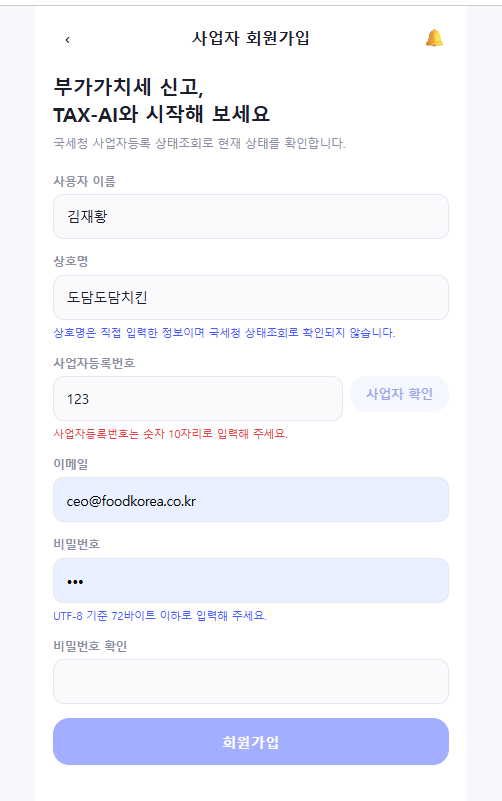

*1. 회원가입 화면에서 3자리 번호의 형식 오류와 조회 버튼 비활성화를 확인했습니다.*

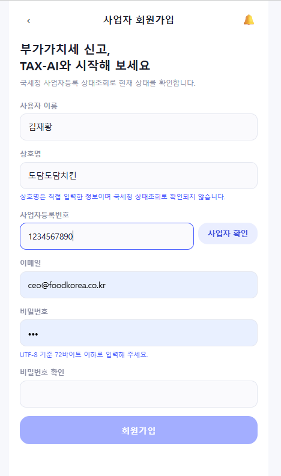

*2. 숫자 10자리 입력으로 조회 버튼이 활성화되지만, 아직 상태조회 완료로 표시되지 않는 화면입니다.*

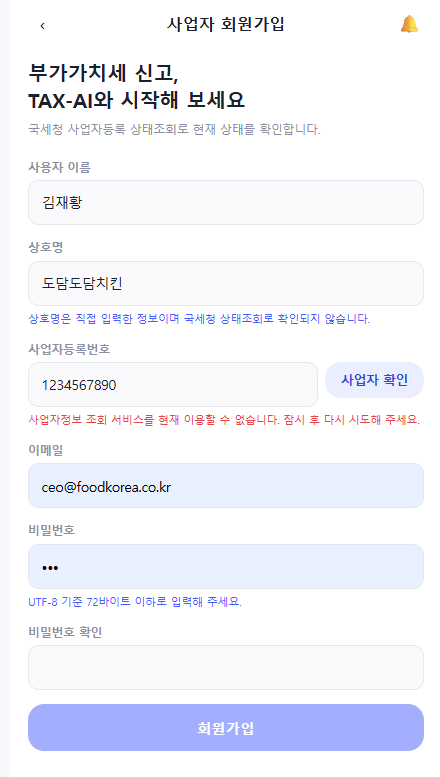

*3. API 키 미설정 환경의 조회 실패 메시지와 회원가입 버튼 비활성화를 확인했습니다.*

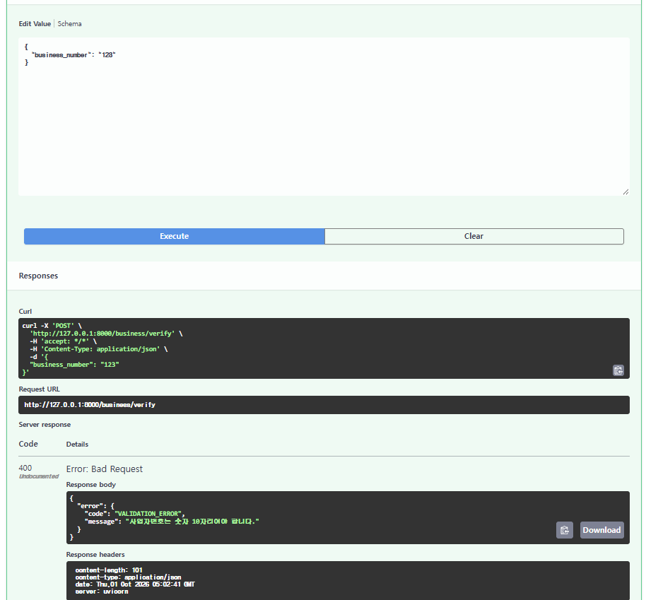

*4. Swagger에서 잘못된 사업자번호 요청에 `400 VALIDATION_ERROR`가 반환된 화면입니다.*

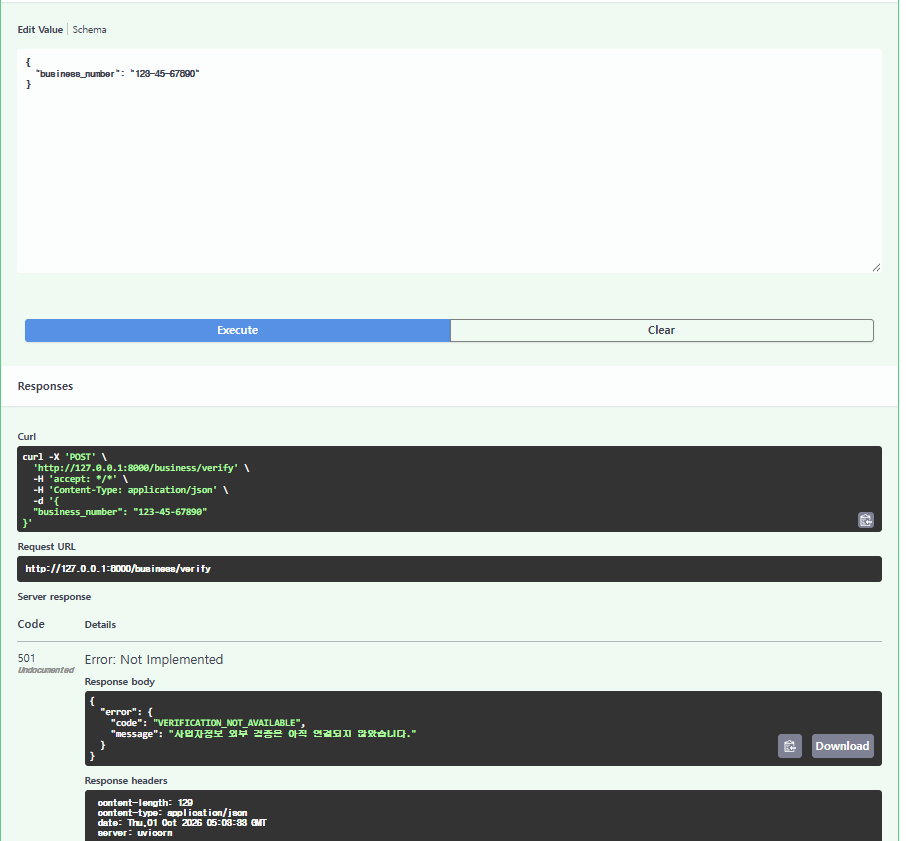

*5. 과거 Step 1 캡처: 당시 형식이 맞는 번호에 반환되던 `501 VERIFICATION_NOT_AVAILABLE`입니다. 현재 endpoint 동작을 나타내지 않습니다.*

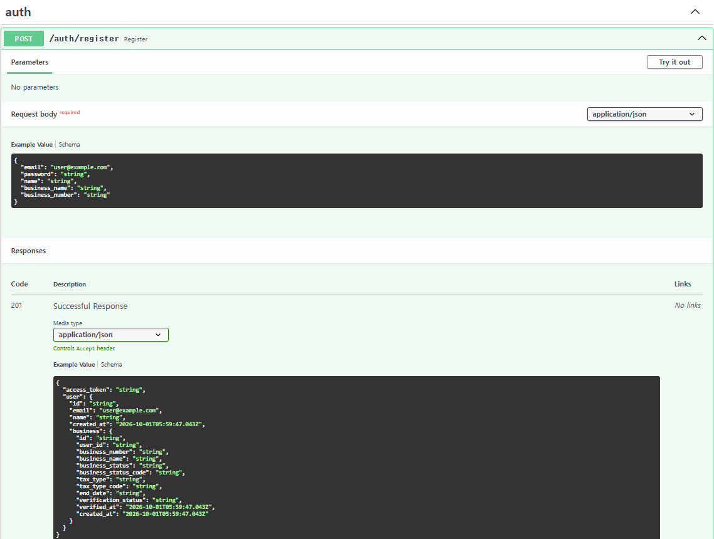

*6. Swagger의 `/auth/register` 요청 필드와 BusinessProfile 포함 응답 스키마입니다.*

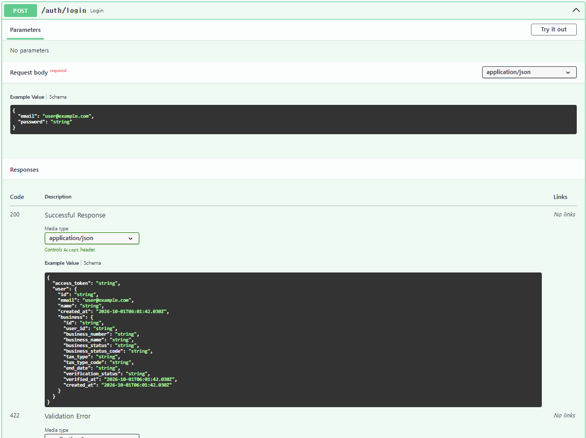

*7. Swagger의 `/auth/login` 요청 및 BusinessProfile 포함 사용자 응답 스키마입니다.*

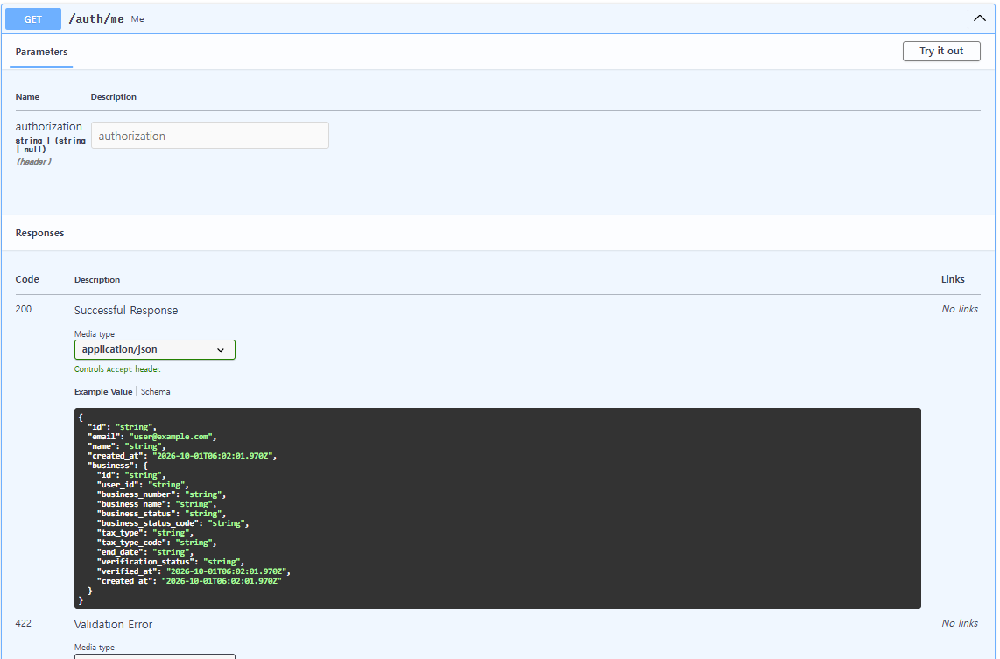

*8. Swagger의 `/auth/me` 인증 헤더와 BusinessProfile 포함 응답 스키마입니다.*

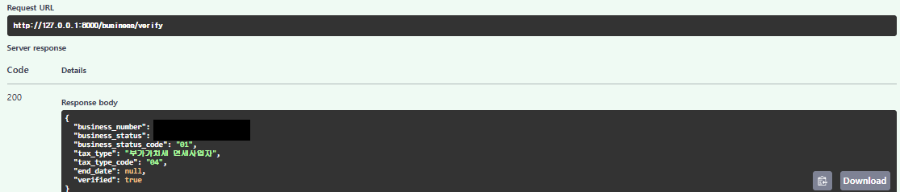

*9. 실제 NTS API Key로 등록 사업자의 상태·과세유형 조회가 `200`으로 성공했습니다. 사업자번호는 가렸습니다.*

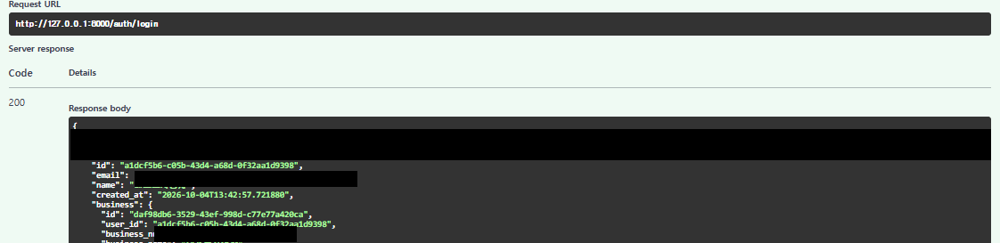

*11. `/auth/login`이 `200`으로 성공하고 저장된 BusinessProfile을 반환했습니다. JWT와 식별 정보는 가렸습니다.*

---

# Sprint 1 — 공용 개발환경 및 CI 기반 구축

## 목적

Sprint 1부터 각 Track이 독립적으로 개발한 기능을 하나의 VAT-AI로 안정적으로 통합하기 위해 공용 개발환경과 자동 검증 기반을 구축하였다.

이번 작업의 핵심은 새로운 사용자 기능을 추가하는 것이 아니라, 각 팀원이 개발한 기능을 동일한 DB·환경·Migration·Test 기준에서 실행하고 안전하게 main에 통합할 수 있는 기반을 만드는 것이다.

## 1. 공용 Local DB 환경

팀원별 PostgreSQL 설정 차이를 줄이기 위해 Docker Compose 기반의 공용 DB 환경을 구성하였다.

기본 구성:

- PostgreSQL 16
- pgvector
- Database: `vatai`
- User: `postgres`
- Port: `5432`

실행:

```bash
docker compose up -d
```

상태 확인:

```bash
docker compose ps
```

정상 환경에서는 `vatai-db`가 `healthy` 상태로 표시되어야 한다.

## 2. pgvector

향후 RAG Pipeline에서 법령 등의 Embedding Vector를 PostgreSQL에 저장할 수 있도록 pgvector 환경을 구성하였다.

새 PostgreSQL Volume 생성 시 다음 초기화 Script를 통해 pgvector Extension이 활성화된다.

```text
docker/postgres/init/01-enable-pgvector.sql
```

초기화 내용:

```sql
CREATE EXTENSION IF NOT EXISTS vector;
```

Local 환경에서 pgvector 0.8.6 활성화 및 Vector 연산을 확인하였다.

## 3. 환경변수 및 Secret 관리

`.env.example`을 공용 환경변수 계약 파일로 정리하였다.

주요 환경변수:

```text
DB_URL
JWT_SECRET
JWT_ALGORITHM
JWT_EXPIRE_MINUTES
OPENAI_API_KEY
NTS_BUSINESS_API_KEY
NTS_BUSINESS_API_URL
NTS_BUSINESS_TIMEOUT_SECONDS
CLOVA_OCR_API_URL
CLOVA_OCR_SECRET_KEY
CLOVA_API_KEY
STORAGE_DIR
MAX_UPLOAD_SIZE_BYTES
MAX_IMAGE_PIXELS
CLOVA_TIMEOUT_SECONDS
```

실제 Secret/API Key는 `.env`에 저장하며 `.env`는 Git Repository에 Commit하지 않는다.

## 4. Alembic Migration 재현성

빈 PostgreSQL 환경에서 다음 명령만으로 현재 DB Schema를 재현할 수 있는지 검증하였다.

```bash
alembic upgrade head
```

현재 Migration Head:

```text
015d7b1f7bdb
```

현재 생성되는 주요 테이블:

```text
users
business_profiles
receipts
deductions
alembic_version
```

`alembic current`와 `alembic heads`가 동일한 Head를 가리키는 것을 확인하였다.

## 5. Backend / DB Health Check

Backend뿐 아니라 PostgreSQL 연결 상태까지 확인하기 위해 다음 Endpoint를 추가하였다.

```text
GET /health
```

정상 응답:

```json
{
  "status": "ok",
  "database": "connected"
}
```

Local 및 main 통합 후 실제 검증에서 HTTP 200 응답을 확인하였다.

## 6. Backend Regression Test

전체 Backend Test:

```bash
PYTHONPATH=. pytest -v
```

Sprint 1 DevOps 환경 main 통합 시점의 검증 결과:

```text
66 passed
```

인증, 사업자 검증, 영수증/OCR, Storage, 공제분석, Migration 등 기존 기능이 공용 개발환경에서도 정상 동작하는 것을 확인하였다.

## 7. GitHub Actions CI

Pull Request가 main에 통합되기 전에 자동으로 Backend를 검증하도록 GitHub Actions CI를 구성하였다.

Workflow:

```text
.github/workflows/ci.yml
```

자동 검증 흐름:

```text
Pull Request
    ↓
Repository Checkout
    ↓
Python 3.12
    ↓
Dependencies 설치
    ↓
PostgreSQL / pgvector
    ↓
Alembic Migration
    ↓
Backend pytest
    ↓
CI 통과 후 Merge
```

Sprint 1 DevOps PR에서 실제 GitHub Actions CI가 정상 통과한 뒤 main에 Merge하였다.

## 8. PR / Merge 규칙

개발 및 통합 규칙은 다음 문서에서 관리한다.

```text
CONTRIBUTING.md
```

기본 원칙:

1. main 직접 작업 및 직접 Push 금지
2. 최신 main에서 Feature Branch 생성
3. 기능 개발 및 Local Test
4. Pull Request 생성
5. GitHub Actions CI 확인
6. CI 통과 후 Merge
7. Merge 후 Regression Test

## 9. 팀원 기본 실행 절차

Repository를 받은 후 공용 개발환경 실행:

```bash
docker compose up -d
alembic upgrade head
```

Backend 실행:

```bash
uvicorn app.main:app --reload
```

Health Check:

```bash
curl -i http://127.0.0.1:8000/health
```

전체 테스트:

```bash
PYTHONPATH=. pytest -v
```

기존 Feature Branch에서 최신 main 반영:

```bash
git fetch origin
git merge origin/main
```

## 10. 현재 개발환경의 의미

기존에는 각 팀원이 자신의 Local DB와 환경설정을 기준으로 기능을 개발할 가능성이 있었다.

현재는 다음 공용 기반을 기준으로 개발한다.

```text
                VAT-AI Repository
                       │
               Docker Compose
                       │
          PostgreSQL 16 + pgvector
                       │
               Alembic Migration
                       │
               동일한 DB Schema
                       │
        ┌──────────────┼──────────────┐
      Track A        Track B        Track C/D
        └──────────────┼──────────────┘
                       │
                 Pull Request
                       │
               GitHub Actions CI
                       │
              Regression Test
                       │
                     main
```

즉 각 Track이 독립적으로 기능을 개발하더라도 동일한 환경에서 통합·검증할 수 있는 기반을 마련하였다.

## 11. 향후 작업

현재 Local 개발환경과 CI 기반 구축은 완료되었다.

향후 다음 작업을 진행한다.

- 팀원별 공용 Local DB 환경 적용 확인
- AWS EC2 환경 구성
- AWS RDS PostgreSQL 구성
- AWS S3 연결
- Staging 환경 구축
- 환경별 CORS 설정
- Staging Migration Deployment 검증
- Staging Health Check
- 장애 발생 시 Log 확인 체계 점검

Staging 구축 전까지 Local 개발 및 PR 검증은 Docker Compose + Alembic + GitHub Actions CI를 공통 기준으로 사용한다.
